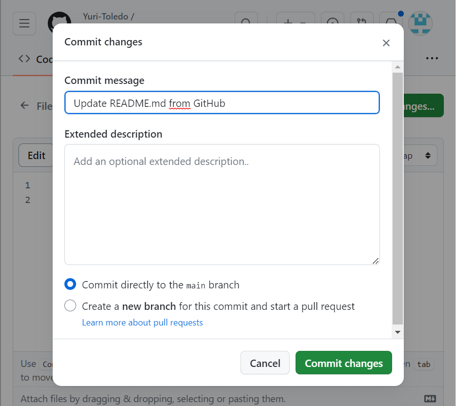
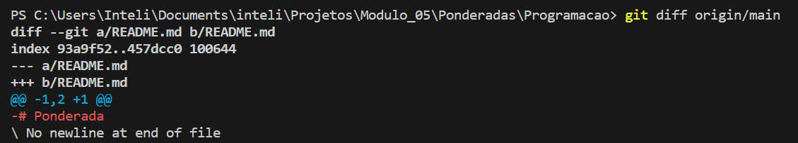
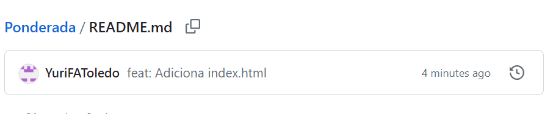
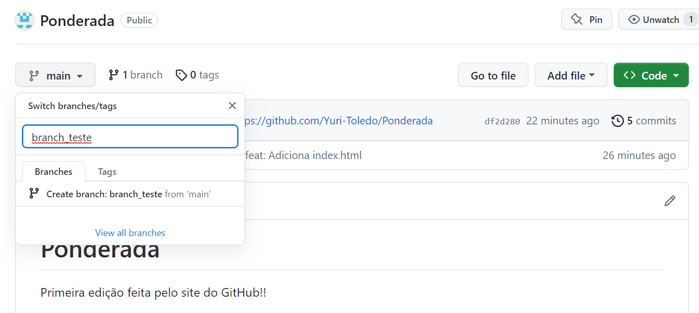
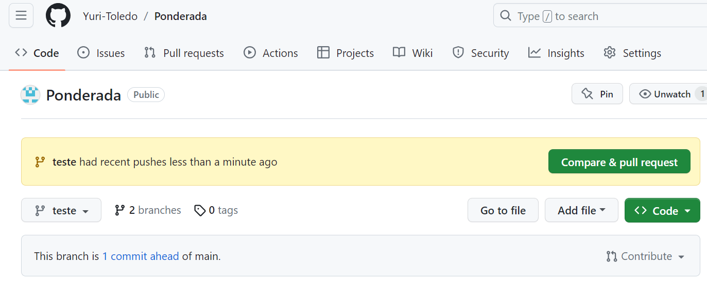
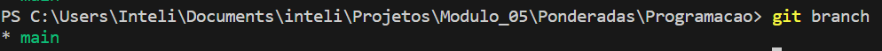
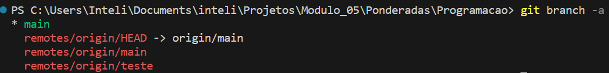
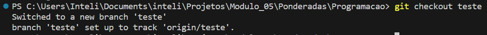

# Ponderada
Primeira edição feita pelo site do GitHub!!

# GitHub Get Started

## Introdução
Passos iniciais no GitHub
## Objetivo
O objetivo desta Seção é ensinar como criar um repositório no GitHub - remoto - e relacionar com um repositório local
## Resultado
Após criar o repositório remoto no Site do GitHub:

Cria-se o diretório onde estará o repositório local e em seguida, o repositório local:

Com ambos criados, devemos agora relacionar o repositório local com o remoto:
Com o terminal aberto no diretório do repositório, usa-se o comando:
`git fetch origin`
## Conclusão
Assim, o seu repositório local estará vinculado com o seu repositório remoto e você esterá pronto para aproveitar as ferramentas que o GitHub oferece.

# GitHub Edit Code

## Introdução
Editar um arquivo pelo GitHub
## Objetivo
O objetivo desta Seção é ensinar como alterar e commitar sua alteração pelo próprio GitHub
## Resultado
Para editar o README.md, basta ir até o ícone de edição:

## Conclusão
Terminou-se então a edição e commit de um arquivo diretamente pelo GitHub

# Pull from GitHub

## Introdução
Fazer um Push do repositório remoto

## Objetivo
O objetivo desta Seção é entender e ver na prática os conceitos fetch, merge e pull

## Resultado
O pull nada mais é que a combinação de dois comandos: fetch e merge
O fetch é responsável por trazer todas as alterações presentes no repositório remoto para o seu repositório local. Pode ser usado o comando: `git fetch origin`
Enquanto o merge atualiza a sua branch local em relação a mesma branch remota. Pode ser usado o comando `git merge origin/<nomedabranch>`
Usando os comandos `git status` ou então `git diff origin/<nomedabranch>` pode-se observar a diferença entre a branch local e remota.
A alternativa mais comum é usar `git pull origin`

## Conclusão
Aqui aprendeu-se 3 conceitos muito importantes e presentes no cotidiano de um desenvolvedor.

# Push to GitHub

## Introdução
Fazer um Push do repositório local para o remoto
## Objetivo
O objetivo desta Seção é ensinar como fazer alterações locais e enviá-las para o repositório remoto
## Resultado
Para começar, adiciona-se um arquivo html no repositório local e commita com o seguinte comando:
`git commit -a -m "feat: Adiciona index.html"`

Agora podemos fazer um push do nosso commit com o comando:
`git push origin`

## Conclusão
Agora é possível fazer alterações localmente e enviar para o remoto.

# GitHub Branch

## Introdução
Entendendo o conceito de Branches no GitHub
## Objetivo
O objetivo desta Seção é ensinar como criar uma branch e fazer uma alteração sem afetar a versão main.
## Resultado

Ao clicar na branch atual, pode-se criar uma nova branch:

A partir daí, editamos o arquivo index.html, apenas na branch teste. Ao comittarmos, teremos a branch teste com uma alteração que não está presente na branch main:

## Conclusão
Nesta Seção pode-se entender como criar nova branchs e visualizar o seu funcionamento

# Pull Branch from GitHub

## Introdução
Com uma nova branch criada no repositório remoto, como podemos usá-la localmente?
## Objetivo
O objetivo desta Seção é ensinar como puxar localmente uma nova branch presente no repositório remoto
## Resultado
para atualizar o nosso repositório local sobre as atualizações feitas no remoto, usa-se o comando `git pull` como mostrado anteriormente.
Com o `git status`, pode-se perceber que a branch está atualizada e com o `git branch`, percebe-se que ainda temos apenas uma branch. 

Por que isso acontece?
Com o pull nós deixamos a nossa versão local do repositório ciente das alterações que foram feitas, mas ainda não puxamos a branch criada para a máquina local. Para evidenciar isso, usando o comando `git branch -a` (-a indica que estamos buscando o repositório local e o remoto), vê-se que está presente a nova branch vindo da origin

Por fim, com o comando `git checkout <nomedabranchnova>`, teremos a branch remota localmente:

## Conclusão

# Push Branch to GitHub
## Introdução
## Objetivo
## Resultado
## Conclusão
