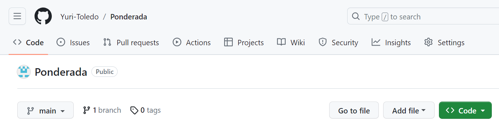
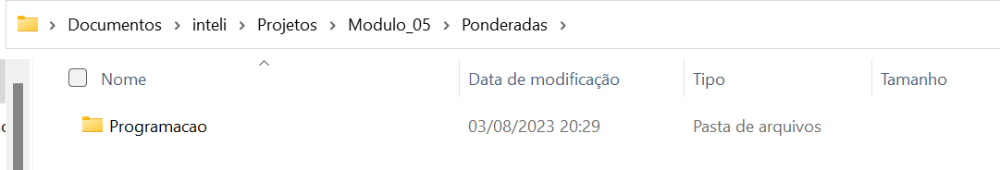
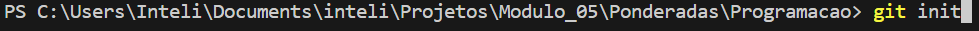
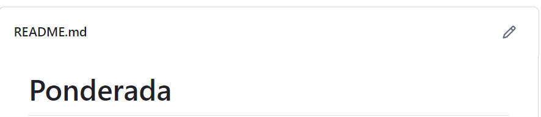
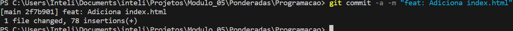

# Ponderada
Primeira edição feita pelo site do GitHub!!

# GitHub Get Started

## Introdução
Passos iniciais no GitHub
## Objetivo
O objetivo desta Seção é ensinar como criar um repositório no GitHub - remoto - e relacionar com um repositório local
## Resultado
Após criar o repositório remoto no Site do GitHub:

Cria-se o diretório onde estará o repositório local e em seguida, o repositório local:

Com ambos criados, devemos agora relacionar o repositório local com o remoto:
Com o terminal aberto no diretório do repositório, usa-se o comando:
`git fetch origin`
## Conclusão
Assim, o seu repositório local estará vinculado com o seu repositório remoto e você esterá pronto para aproveitar as ferramentas que o GitHub oferece.

# GitHub Edit Code

## Introdução
Editar um arquivo pelo GitHub
## Objetivo
O objetivo desta Seção é ensinar como alterar e commitar sua alteração pelo próprio GitHub
## Resultado
Para editar o README.md, basta ir até o ícone de edição:

## Conclusão
Terminou-se então a edição e commit de um arquivo diretamente pelo GitHub

# Pull from GitHub

## Introdução
Fazer um Push do repositório remoto
## Objetivo
O objetivo desta Seção é entender e ver na prática os conceitos fetch, merge e pull
## Resultado
O pull nada mais é que a combinação de dois comandos: fetch e merge
O fetch é responsável por trazer todas as alterações presentes no repositório remoto para o seu repositório local.
Enquanto o merge atualiza a sua branch local em relação a mesma branch remota
## Conclusão
Aqui aprendeu-se 3 conceitos muito importantes e presentes no cotidiano de um desenvolvedor.

# Push to GitHub

## Introdução
Fazer um Push do repositório local para o remoto
## Objetivo
O objetivo desta Seção é ensinar como fazer alterações locais e enviá-las para o repositório remoto
## Resultado
Para começar, adiciona-se um arquivo html no repositório local e commita com o seguinte comando:
`git commit -a -m "feat: Adiciona index.html"`

Agora podemos fazer um push do nosso commit com o comando:
`git push origin`

## Conclusão
Agora é possível fazer alterações localmente e enviar para o remoto.

# GitHub Branch

## Introdução
Entendendo o conceito de Branches no GitHub
## Objetivo
O objetivo desta Seção é ensinar como criar uma branch e fazer uma alteração sem afetar a versão main.
## Resultado

## Conclusão

# Pull Branch from GitHub

## Introdução
## Objetivo
## Resultado
## Conclusão

# Push Branch to GitHub
## Introdução
## Objetivo
## Resultado
## Conclusão
